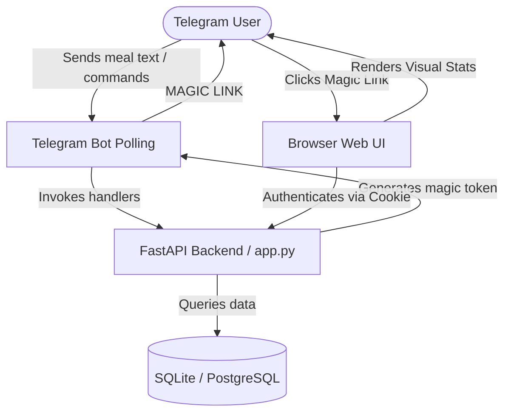

# AI Fitness & Meal Agent 🏋️‍♂️🥗

A smart Telegram bot and companion Web UI Dashboard designed to help users track their nutrition, workouts, and weight to achieve consistent fitness results.

---

## 🌟 Vision & Purpose

**"Most people fail to see results from their fitness journey not because they aren't putting in the effort, but because they aren't tracking objectively."**

People invest significant time, money, and energy into workouts and nutrition. However, without consistent, accurate tracking, it is difficult to identify what is going wrong when progress stalls. This application aims to eliminate that friction by offering:
- **Low-friction natural language tracking:** Users describe their meals in plain English, and the AI does the heavy lifting of estimating macros (Calories, Protein, Carbs, Fat).
- **Daily habit consistency (Workout Streaks):** Keeps users accountable by asking them about their workouts daily at 11:30 PM, maintaining a streak (with rest day flexibility) to build long-term habits.
- **Visual Clarity:** A secure, passwordless Web UI Dashboard that brings tracking data to life, allowing users to spot patterns in their diet and workouts.

---

## 🚀 Key Features

- **Natural Language Meal Logging:** Simply type what you ate (e.g., `2 eggs and toast` or `/yesterday 3 rotis, paneer sabzi`) to log it.
- **AI-Powered Nutrition Estimations:** Uses OpenRouter (Gemini 2.5 Flash Lite) or Ollama (Llama 3.1 8b) for parsing meals into structured macros.
- **Database Food Calibration:** Overrides AI estimates with precise, curated values for common items (like eggs, banana, roti) to maintain absolute consistency.
- **Macros Progress Tracking:** Tracks daily intake against customizable calorie and protein targets (/set_goal).
- **Weight History Tracker:** Log daily weight (/track_weight) to visualize trends.
- **Gym Workout Streaks:** Tracks daily workout logs, offering interactive Telegram polls (Yes/No) at 11:30 PM.
- **Magic-Link Web UI Dashboard:** Generates a secure, passwordless magic link to open a premium glassmorphism Web SPA with circular progress rings and weekly trends charts.

---

## 🏗️ Architecture Overview

The app runs as a single, lightweight container housing both the Telegram Bot Polling service and a FastAPI web server (serving the SPA dashboard and the REST API).

---

## 🛠️ Bot Commands

- `/start` / `/help`: Welcome message & onboarding instructions.
- `/today`: Today's macro stats and goals progress.
- `/yesterday <meal>`: Log a meal for yesterday.
- `/yesterday_summary`: View yesterday's macro stats.
- `/dashboard`: Generates a secure, 5-minute magic login link to the Web UI.
- `/set_goal <calories> <protein>`: Set daily macronutrient targets.
- `/track_weight <weight>`: Log daily weight in kg.
- `/delete_meal`: Interactive callback keyboard to delete today's meal logs.
- `/reminders` / `/set_reminder <HH:MM>`: View and configure meal logging reminders.
- `/timezone <timezone_name>`: Set your local IANA timezone.
