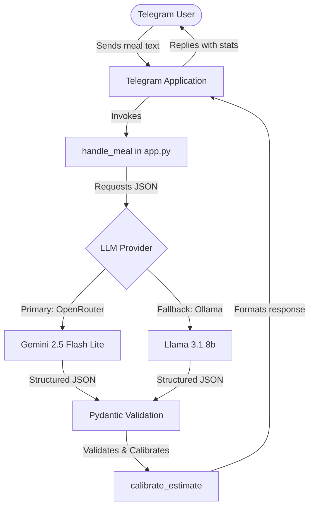

# AI Meal Agent - Agent Guidelines (`agents.md`)

Welcome! This document provides an architectural overview, design patterns, and instructions for any AI agent working on the **AI Meal Agent** codebase.

---

## 🏗️ Architecture Overview

The AI Meal Agent is a Telegram bot designed to estimate and track calories and protein from natural language meal descriptions.



### Key Components

1. **`app.py`**: The single core entrypoint containing all logic (Telegram Handlers, Pydantic schemas, LLM communication, Calibration).
2. **Pydantic Validation**:
   - `EstimatedFood`: Validates individual items (name normalization, quantity cleanup, non-negativity constraint).
   - `MealEstimate`: Validates the full meal list and total calories/protein.
3. **Dual-LLM Engine**:
   - **Primary**: OpenRouter API (`google/gemini-2.5-flash-lite` by default).
   - **Fallback**: Local Ollama instance (`llama3.1:8b` by default).
4. **Calibration System**:
   - Compares the LLM-returned canonical food names against `CALIBRATED_FOODS` (e.g., egg, roti, banana).
   - Overwrites LLM estimates with high-accuracy database/custom values multiplied by the parsed quantity to ensure consistency.

---

## 🛠️ Key Data Structures

### Food Name Aliases (`FOOD_NAME_ALIASES`)
Normalizes common user terminology to singular canonical food names:
```python
FOOD_NAME_ALIASES = {
    "rotis": "roti",
    "chapati": "roti",
    "chapatis": "roti",
    "eggs": "egg",
    ...
}
```

### Calibrated Foods (`CALIBRATED_FOODS`)
Provides standard reference values for calories and protein per unit:
```python
CALIBRATED_FOODS = {
    "egg": {"calories": 70, "protein": 6},
    "egg white": {"calories": 17, "protein": 4},
    "roti": {"calories": 110, "protein": 3},
    "banana": {"calories": 105, "protein": 1},
}
```

---

## 🛠️ Bot Commands & Handlers

The application registers the following core Telegram bot commands:
- `/start` & `/help`: Display welcome message and help instructions.
- `/today`: Show today's macro stats, calorie consumption, and progress against goals.
- `/set_goal <calories> <protein>`: Configure daily calorie and protein targets (or `/set_goal off` to clear).
- `/delete_meal`: Interactive meal deletion via inline keyboard buttons for meals logged on the same day.
- `/reminders` & `/set_reminder <HH:MM>`: View and configure daily meal logging reminders.
- `/timezone <timezone_name>`: Set the user's local timezone (e.g. `Asia/Kolkata`) for bounds calculations.

---

## 🚀 Environment Setup & Run Instructions

### 1. Requirements
Ensure dependencies from [requirements.txt](file:///Users/naveenburathi/Documents/Projects/ai-meal-agent/requirements.txt) are installed in a Python virtual environment:
```bash
python3 -m venv venv
source venv/bin/activate
pip install -r requirements.txt
```

### 2. Environment Variables (`.env`)
Create a `.env` file in the root directory:
```env
TELEGRAM_BOT_TOKEN=your_telegram_bot_token
OPENROUTER_API_KEY=your_openrouter_api_key
OPENROUTER_MODEL=google/gemini-2.5-flash-lite  # Optional
OLLAMA_BASE_URL=http://localhost:11434        # Optional
OLLAMA_MODEL=llama3.1:8b                      # Optional
DATABASE_URL=sqlite:///meals.db               # Use postgresql+psycopg2:// in production
PORT=10000                                    # Port for health check web server
RENDER_EXTERNAL_URL=https://your-app.onrender.com # Used for automatic self-pinger
```

### 3. Running the Bot
Start the application:
```bash
python app.py
```

---

## 📝 Guidelines for Future Modifications
- **Structured Schema**: Always enforce structured outputs. When adding fields, ensure to update the corresponding Pydantic models (`EstimatedFood` or `MealEstimate`) and check that JSON schemas are generated correctly.
- **Urllib Dependency**: Keep HTTP requests using the standard Python library `urllib` to minimize third-party library bloat.
- **Extend Calibration**: If users report inaccurate estimations for specific common foods, add them to `CALIBRATED_FOODS` and matching plural forms to `FOOD_NAME_ALIASES`.
- **Database Engine**: Ensure all user ID fields use `BigInteger` instead of standard `Integer` to support 64-bit Telegram user IDs. Always set `pool_pre_ping=True` and `pool_recycle=280` on `create_engine` to handle serverless database disconnects gracefully.

