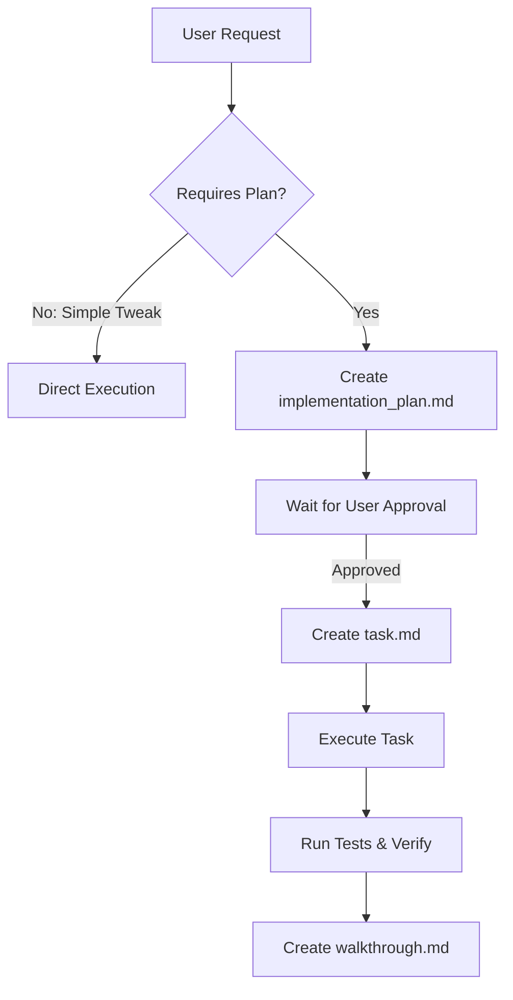

# Antigravity Developer Guide (`antigravity.md`)

This guide is dedicated to **Antigravity**, the Google DeepMind agentic AI coding assistant, to optimize its execution, tool usage, and design standards when modifying this repository.

---

## 🛠️ Antigravity's Capabilities & Tools

Antigravity operates with a powerful set of tools on a macOS system running zsh:
- **File System Tools**: `view_file`, `write_to_file`, `replace_file_content`, and `multi_replace_file_content`.
- **Command execution**: `run_command` (reusable terminal session IDs) and `command_status`.
- **Web interaction**: `browser_subagent` (automated browser control) and `read_url_content`.
- **Media generation**: `generate_image` for creating UI assets or visual content.

---

## 📋 Implementation Workflow (Planning Mode)

Antigravity enforces a strict **Planning Mode** before executing non-trivial tasks:

### Artifact Paths
- **Implementation Plan**: `<appDataDir>/brain/<conversation-id>/implementation_plan.md`
- **Task Checklist**: `<appDataDir>/brain/<conversation-id>/task.md`
- **Walkthrough**: `<appDataDir>/brain/<conversation-id>/walkthrough.md`

---

## 🎨 Design & Aesthetic Rules

If the task involves adding or styling a web interface, dashboard, or visual representation:
1. **Rich Aesthetics**: Interfaces must look state-of-the-art and premium. Use curated color palettes, dark modes, smooth gradients, and glassmorphism.
2. **Dynamic UI**: Add subtle micro-animations (e.g., transitions, hover transformations) to make interactions feel responsive and alive.
3. **Typography**: Load modern Google Fonts (e.g., Inter, Outfit, Roboto) instead of default system fonts.
4. **No Placeholders**: Never use generic grey boxes or text placeholders. Use `generate_image` to generate premium images or assets.

---

## ⚠️ Important Guidelines
- **Context Retrieval**: Always check **Knowledge Items (KIs)** first, followed by **Conversation Logs** under `<appDataDir>/brain/<conversation-id>/.system_generated/logs/overview.txt` before starting research.
- **Auto-run Commands**: Never set `SafeToAutoRun = true` on terminal commands that delete files, mutate configuration, install system-wide packages, or perform external network requests.
- **File Link Formatting**: Use standard markdown link syntax (e.g., `[app.py](file:///absolute/path/app.py)`) without enclosing the link text in backticks.
